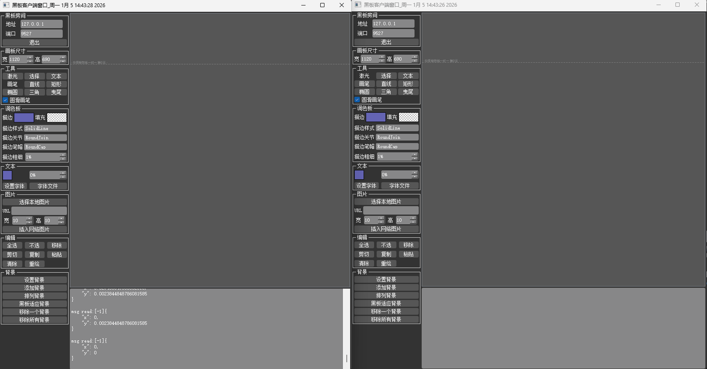

# Qt Blackboard

For Chinese, see [README.md](README.md)

## Project Introduction

A blackboard module used in the NiushiBang Online Classroom. It provides some drawing functions.

## Effect Preview

## Software Architecture

Developed based on the Qt Graphics View Framework (The QGraphics View Framework).

## Running Examples, Building Dynamic Libraries

Build and run blackboard.pro in both Debug and Release modes. You can find the qt_blackboard_shared directory in the directory one level above the project directory.

## How to Contribute

1. Fork this project.
2. Create a new Feat_xxx branch.
3. Commit your code.
4. Create a new Pull Request.