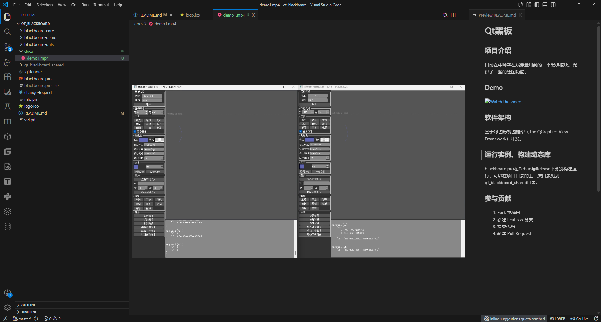

# Qt黑板

For English, see [README.en.md](README.en.md)  

## 项目介绍

牛师帮在线课堂用到的一个黑板模块。提供了一些的绘图功能。

## 效果预览

## 软件架构

基于Qt图形视图框架（The QGraphics View Framework）开发。

## 运行实例、构建动态库

blackboard.pro在Debug与Release下分别构建运行，可以在项目目录的上一层目录见到qt_blackboard_shared目录。

## 参与贡献

1. Fork 本项目
2. 新建 Feat_xxx 分支
3. 提交代码
4. 新建 Pull Request
